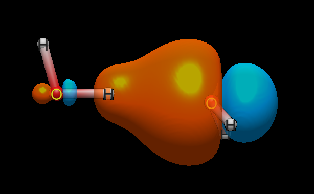

# avo_ibo

`avo_ibo` is a plugin for Avogadro 2 (and standalone CLI) that computes and
visualizes Intrinsic Bond Orbitals (IBOs) using
[Psi4](https://psicode.org) for SCF and wavefunction generation, then
performs post-SCF IAO/2014 orbital construction (Knizia, *J. Chem. Theory
Comput.* **2013**, *9*, 4834) and Pipek-Mezey localization directly in the
plugin. Valence-virtual construction follows Derricotte–Evangelista
(*J. Chem. Theory Comput.* **2017**, *13*, 5984).

## Capabilities

* Occupied and valence-virtual IBOs — Pipek-Mezey localization (p=2 warmup + p=4 refinement, conv 1e-12)
* On-atom degeneracy resolution via post-PM Fock diagonalization
* Bond-flat degeneracy resolution — flat {σ, π} planes of symmetric bonds are Fock-diagonalised so distorted geometries yield σ+π (not banana bonds) deterministically
* Valence-virtual IBOs via fixed-count VVO construction (Derricotte–Evangelista,
*J. Chem. Theory Comput.* **2017**, *13*, 5984): singular-value projection of
canonical virtual MOs onto IAO space, PM-localized; bond-flat resolution applies
to the virtual block too, so distorted geometries yield σ*+π* deterministically
* IAO-basis Molden export with Fock-diagonal energies for Avogadro rendering
* Analysis table (`ibos.txt`) — occupancy, energy, bond type, atomic composition, s/p/d hybridization, partial charges, bond orders (density Wiberg decomposed into σ and π, σ+π = total exactly)
* Standalone CLI (`python -m avogadro_ibo molecule.xyz`) and Avogadro in-app mode
* Full mathematical derivation in [`mathematics/mathematics.md`](mathematics/mathematics.md) with paper equation references

New to IBO output? Start with the [guide to reading `ibos.txt`](examples/how-to-read-ibos.md) before anything else.

Project notebooks: [NOTES.md](NOTES.md) (open items, design decisions),
[AGENTS.md](AGENTS.md) (development context and gotchas).
Release history: [CHANGELOG.md](CHANGELOG.md).

## Validation

We checked our charges against two independent IBO programs (IboView
and ORCA) on five molecules. Same minimal basis gives the same numbers
to **0.006 electrons**; different minimal bases give known, fixed
offsets. Details: [validation/Validation.md](validation/Validation.md).

## Spotlight: a hydrogen bond, quantified

In the water dimer, the acceptor lone pair spills 2.2% onto the donor
hydrogen, the donor O–H weakens 0.942 → 0.867, and the H···O contact
carries bond order 0.075 — LP→σ* donation read straight off the
analysis table. Full writeup: [examples/water-dimer.md](examples/water-dimer.md).




## Quick Start

### Avogadro Plugin (easiest)
Requires [pixi](https://pixi.sh).

```powershell
git clone https://github.com/exergonic/avo_ibo.git
cd avo_ibo
pixi install
```

Then create a symlink so Avogadro finds the plugin (run PowerShell as Administrator):

```powershell
New-Item -ItemType SymbolicLink -Path "$env:LOCALAPPDATA\OpenChemistry\Avogadro\plugins\avo_ibo" -Target "C:\path\to\avo_ibo"
```

Restart Avogadro. Go to **Extensions → Intrinsic Bond Orbitals → Compute IBOs**.

Orbitals appear in the **Molecular Orbitals** panel.

### Development Setup
Requires [pixi](https://pixi.sh).

```shell
git clone https://github.com/exergonic/avo_ibo.git
cd avo_ibo
pixi install
pixi run test
```


### Standalone CLI
```shell
pixi run python -m avogadro_ibo molecule.xyz
```

Writes to `calcs/` (ibo.molden, canonical.molden, ibos.txt, psi4.log).

### pip (no pixi)

```shell
pip install git+https://github.com/exergonic/avo_ibo.git
```

Psi4 must be installed separately via conda.

## Data location

Each run writes a `{molecule}_NNN/` folder under the configured output
home (default: the plugin's `calcs/` directory). In Avogadro, change it
via the Options dialog (**Run calculations in**); on the CLI pass
`--output-dir <folder>`. The settings file itself always stays in the
plugin directory, so moving the output home never orphans the setting.
Inside each run folder:

* `input.xyz` - the input molecule used for calculations
* `ibos.txt` — analysis table with per-orbital data
* `ibo.molden` — IAO-basis orbitals for visualization
* `canonical.molden` — canonical MOs for reference visualization
* `psi4.log` — Psi4 SCF output

## Limitations and Considerations

* **Closed-shell only.**
  The IAO/IBO pipeline treats all occupied
  orbitals as doubly occupied (RHF-style).  Open-shell systems
  (radicals, triplet states, broken-symmetry calculations) are not
  supported.  The SCF will still run, but the orbital construction,
  analysis, and Molden output will be invalid.

* **Symmetric molecules.**
  Pipek-Mezey localization uses fixed sequential Jacobi sweeps.  For
  highly symmetric molecules, symmetry-equivalent orbitals may show
  small (sub-milliHartree) energy splittings (a known consequence of
  the orthogonality constraint — see Knizia JCTC 2013 and
  `mathematics.md`).

* **Analysis Table vs. Isosurface Tails**
  The IBO analysis table (`ibos.txt`) reports orbital compositions in the
  IAO basis, where populations are clean and bond assignments are crisp.
  The Molden isosurfaces are rendered in the full SCF basis via the
  projection `C_AO = C_IAO @ C_IAO_all`, which correctly includes the
  IAO repolarization components.

  These two representations are slightly inconsistent by construction:
  small density tails visible on non-dominant atoms in the isosurface
  are physically real repolarization contributions, not rendering
  artifacts or bugs.  The analysis table intentionally omits these for
  clarity of chemical interpretation.  This discrepancy is
  mathematically unavoidable and is present in all IAO-based
  implementations.

  These small tails represent the repolarization of each intrinsic atomic orbital in
  response to the molecular environment. It is the same physics that makes
  bonds polar and atoms non-spherical in molecules. The analysis table reports
  populations in the compressed IAO basis for chemical clarity; the
  isosurface renders the full physical wavefunction including these
  repolarization contributions.


## Learning the output

The `examples/` directory holds a
section-by-section [guide to reading `ibos.txt`](examples/how-to-read-ibos.md)
plus worked molecule spotlights — carbocations, aromaticity, bent
bonds, hyperconjugation, hydrogen bonding — each with run commands,
verified numbers, and orbital images. Start there before the
mathematics.

## License

BSD 3-Clause. See [LICENSE](LICENSE).
