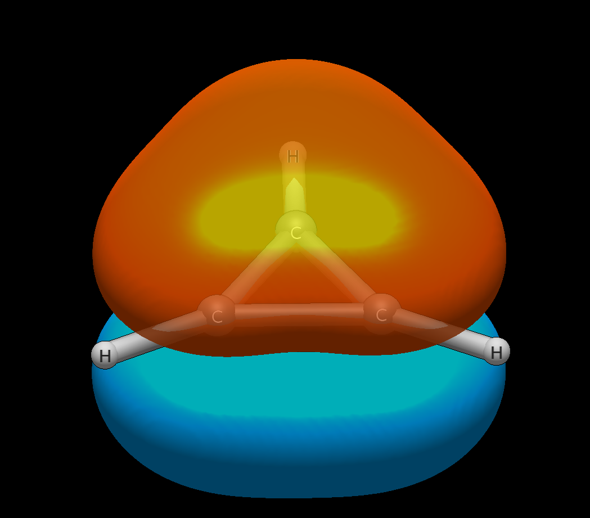
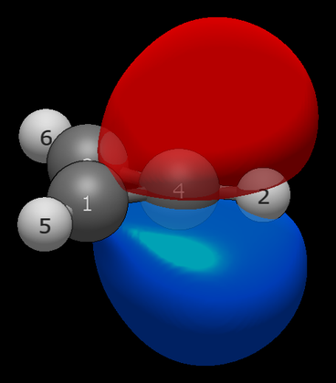

# Aromaticity made visible: cyclopropenyl cation vs anion

Hückel's rule (4n+2 stable, 4n unstable) is usually taught as electron
counting. These three calculations show it as orbital structure: the
aromatic cation delocalises perfectly, the antiaromatic anion refuses
to, and the relaxed anion escapes into nonaromaticity. All at
wB97X-D/def2-TZVP.

## Cation, C₃H₃⁺ — the perfect thirds

```
Input: cyclopropenium.xyz  (D3h, charge +1)
Run:   pixi run python -m avogadro_ibo examples/cyclopropenium.xyz --method wB97X-D --basis def2-TZVP --charge 1 --spin 1
```

```
   10    2.000   -0.762202        C-C-C 2e3c  C1(33.3%) + C3(33.3%) + C4(33.3%)              100% 2pz                  0.0    <- HOMO
```

The classifier invents exactly the right label: `C-C-C 2e3c`, perfect
thirds, zero ionicity, pure 2pz — the aromatic π bond as a single
number. PM had no gradient to break the symmetry and converged to the
mathematically perfect result. Wiberg C–C is 1.429 on all three sides
(σ 0.984 + π 0.444): less than the naive 1 + 2/3 ≈ 1.667 because the σ
framework pulls density from the π system.

The virtuals break the pattern instructively: orb 11 is two-centre
`C3(51%) + C4(49%)` while orb 12 is asymmetric three-centre
`C1(66.6%) + C4(17.7%) + C3(15.7%)` — PM localises virtuals differently
from occupieds even under perfect D3h symmetry. (The virtual block gets
the same bond-flat tie-break as the occupied block; the asymmetry above
is PM localization itself differing between blocks — see
[../NOTES.md](../NOTES.md).)


*Orbital 10 (HOMO) viewed obliquely: one phase above the ring plane,
the opposite below, spread evenly over all three carbons — the
33/33/33 table entry rendered.*

## Anion planar, C₃H₃⁻ — antiaromaticity refuses to delocalise

```
Input: cyclopropenyl_anion_planar.xyz  (constrained planar, charge -1)
Run:   ... --charge -1 --spin 1
```

```
   11    2.000    0.028577             C(LP)  C4(100.0%)                                     100% 2pz                  ---    <- HOMO
```

The positive HOMO (+0.0286 Ha, above vacuum) is the headline: the extra
electron is thermodynamically unstable toward autodetachment — the
quantum-mechanical signature of why this anion is barely observable.
The 4π system avoids itself completely: C4 carries −0.865 (essentially
the whole charge), the C1–C3 bond is 1.981 (a full double bond, π 1.000
localised on C1/C3 only — C4 excluded), and C1–C4/C3–C4 are 0.978
singles. A vinyl carbanion, exactly as Lewis structures predict. Compare
the cation's 33/33/33 against this total localisation: the pair is
Hückel's rule with nothing left to the imagination.



## Anion relaxed (nonplanar) — escape into nonaromaticity

```
Input: cyclopropenyl_anion_nonplanar.xyz  (charge -1)
```

Let the geometry relax out of plane and the story changes: HOMO drops
to −0.090 Ha (bound again), the carbanion LP rehybridises to 53% 2s +
47% 2p, and the charge spreads (−0.626 on the carbanion carbon). One
C=C double (~2.0) persists, but the system is now an ordinary localised
alkene-plus-lone-pair — nonaromatic, unremarkable, stable. The
planar→nonplanar pair is the antiaromaticity penalty rendered as two
ibos.txt files: +0.029 vs −0.090 Ha for the same electron.

Notably, the nonplanar geometry's detail section fires genuine σπ
mixing lines (e.g. `C3-C4: orb7(C-C π) × orb10(C-C σ): -0.0225`) — the
bent-bond early warning working as designed, since nonplanarity defeats
the σ/π symmetry separation. The planar anion shows no such lines.

## The comparison

| Property | Cation (aromatic) | Anion planar (antiaromatic) | Anion relaxed (nonaromatic) |
|---|---|---|---|
| HOMO energy | −0.762 Ha | +0.029 Ha | −0.090 Ha |
| π character | delocalized thirds (33/33/33) | C1–C3 double, π 1.000 on C1/C3 | localized alkene + lone pair |
| Carbanion charge | — | −0.865 | −0.626 |
| C–C orders | 1.429 ×3 | 1.981 + 0.978 ×2 | ~2.0 + singles |
