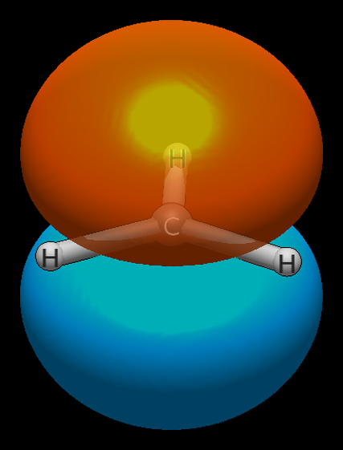
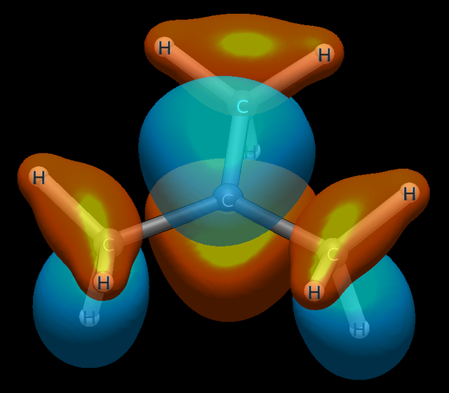
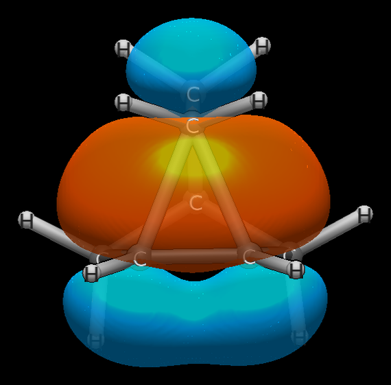

# Carbocations: bare, bridged, classical — and the historical system itself

The nonclassical-vs-classical carbocation debate is one of the most famous
controversies in organic chemistry. Three molecules below resolve it visually
and quantitatively in a single ladder: the bare ion, the bridged ion, and
the hyperconjugatively stabilized ion. A fourth section then runs the
historical system itself — the 2-norbornyl cation — through the same
pipeline. All run at wB97X-D/def2-TZVP;
reproduce with the commands shown.

## Methyl, CH₃⁺ — the bare baseline

```
Input: methyl.xyz  (charge +1; ORCA 6.1.1 wB97X-D3/def2-TZVP opt + freq, no imaginary modes)
Run:   pixi run python -m avogadro_ibo examples/methyl.xyz --method wB97X-D --basis def2-TZVP --charge 1 --spin 1
```

Orbital 5 is the whole story:

```
    5    0.000   -0.365417           C(virt)  C1(100.0%)               100% 2px                  ---    <- LUMO
```

The LUMO is a pure 2p on carbon — 100.0%, no tails anywhere. Nothing
donates into it because there is nothing to donate: three C–H σ bonds
(0.961 each, no interference to report) and an empty orbital orthogonal
to all of them. The charge has nowhere to go: C1 +0.406, each H +0.198.
At −0.365 Ha it is by far the deepest LUMO on this page — the
bare electrophile against which the other two ions measure their
stabilization.


*Orbital 5 (LUMO): pure 2px on C1, 100% — the bare empty p with no
tails. Set against t-butyl's 80.5%, the missing 19.5% is
hyperconjugation made visible.*

## Ethylium, C₂H₅⁺ — bridged and nonclassical

```
Input: ethylium.xyz  (H6 bridges the C–C axis; charge +1)
Run:   pixi run python -m avogadro_ibo examples/ethylium.xyz --method wB97X-D --basis def2-TZVP --charge 1 --spin 1
```

Orbital 4 is the whole story:

```
    4    2.000   -0.890787        C-C-H 2e3c  H6(38.5%) + C3(30.7%) + C1(30.7%)    C: 5% 2s + 95% 2px       11.2     <- HOMO
```

The classifier labels it `C-C-H 2e3c` with no special casing — a
three-centre two-electron bond, perfectly symmetric between the carbons,
with hydrogen carrying the largest single share. In `ibo.molden` it
renders as a dome spanning both carbons with H6 symmetric above the axis:
a protonated double bond.

The Wiberg orders confirm the bridge quantitatively:

```
  C1-C3         1.414   1.414   0.000  (+0.011: σ+0.011, π+0.000)
  C3-H6         0.473   0.473   0.000
  C1-H6         0.473   0.473   0.000
```

H6 is half-bonded to each carbon simultaneously (0.473 + 0.473), and the
C–C bond (1.414) is stronger than a single bond because the bridge
reinforces it. Charges: C1/C3 +0.078 each (identical — symmetry intact),
H6 +0.224, carrying the bulk of the positive charge despite being the
bridge atom. The near-zero LUMOs (−0.064 Ha) flag genuine instability:
the ion is barely holding together.


## Tert-butyl, C₄H₉⁺ — textbook classical

```
Input: tbutyl.xyz  (charge +1)
Run:   pixi run python -m avogadro_ibo examples/tbutyl.xyz --method wB97X-D --basis def2-TZVP --charge 1 --spin 1
```

Everything ethylium wasn't. The LUMO is the classic empty p orbital —
80.5% on C1, pure 2py — with 4.4% tails on each methyl carbon. The
charge sits exposed: C1 +0.400, no bridging, C–C orders of only 1.121
against ethylium's 1.414. The LUMO at −0.169 Ha is *more* negative than
ethylium's −0.064: t-butyl is the more electron-deficient ion, because
bridging stabilises ethylium by filling the empty orbital with a 3c–2e
bond that t-butyl cannot form.


*Orbital 17 (LUMO): the classic empty p — 80.5% on C1, pure 2py —
with 4.4% tails on each methyl carbon, the hyperconjugative
delocalization rendered.*

Hyperconjugation, quantified. Two distinct C–H families emerge:

- Orbitals 8–10: `C(52.8%) + H(42.3%) + C1(4.6%)` — axial C–H bonds
  aligned to donate into the empty p; through-bond C1–H Wiberg **0.059**.
- Orbitals 11–16: `C(54.6%) + H(44.0%) + C1(1.1%)` — equatorial C–H
  bonds near-perpendicular to the empty p; C1–H Wiberg **0.012**.

The 5:1 ratio (0.059 vs 0.012) is the dihedral-angle (cos²φ) dependence
of hyperconjugation made quantitative — axial donors beat equatorial
ones fivefold, exactly as textbook orbital overlap predicts. The C–C
1.121 orders carry the same signature: slight π character from methyl
donation, far below true bridging.

## 2-Norbornyl, C₇H₁₁⁺ — the historical system itself

```
Input: norbornyl.xyz  (charge +1; start: Scholz et al. Science 2013 SI minimum,
        ORCA 6.1.1 wB97X-D3/def2-TZVP opt + freq, no imaginary modes)
Run:   pixi run python -m avogadro_ibo examples/norbornyl.xyz --method wB97X-D --basis def2-TZVP --charge 1 --spin 1
```

Orbital 19 is the Scholz structure in our vocabulary:

```
   19    2.000   -0.772446        C-C-C 2e3c  C7(39.3%) + C3(29.9%) + C4(29.9%)               16% 2s + 84% 2py         13.6
```

The classifier labels it `C-C-C 2e3c` with no special casing — symmetric
to 0.1% between the bridgeheads, with the bridging carbon carrying the
largest share, exactly the ethylium pattern (H6 38.5% + C 30.7/30.7).
The Wiberg orders confirm it quantitatively: C3–C7 = C4–C7 = **0.514 /
0.514**, against ethylium's 0.473 / 0.473, and the bridgehead pair C3–C4
carries 1.275 with a live −0.092 interference parenthetical. Charges:
C3/C4 +0.097 each (identical — symmetry intact), next to ethylium's
+0.078 ×2. The two bridges are quantitative siblings; Brown's classical
alternatives appear nowhere in the table.

The geometry cross-validates the method: the opt retains the SI bridge
at 1.8183/1.8183 against Scholz's 1.8250 (Δ0.007) with the σᵥ plane
intact, so the starting structure doubles as an independent check our
level passes.

And the ladder gets its ending: the LUMO is **+0.001 Ha**, a degenerate
π* pair spread over the cage — there is no low empty-p orbital left.
Bridging hasn't just stabilized the electrophile here; it has filled it,
promoting the cationic character fully into the occupied 3c–2e orbital
at −0.772 Ha. The fourth rung isn't "more stabilized." It is "nothing
left to stabilize."


*Orbital 19, viewed centred on the C3–C4–C7 triad (cage behind): the
3c–2e bridge — C7 39.3% + C3/C4 29.9% each — symmetric to 0.1%.*

## The comparison

| Property | Methyl (bare) | Ethylium (bridged) | tert-Butyl (classical) | Norbornyl (bridged) |
|----------|---------------|--------------------|------------------------|---------------------|
| Charge on C⁺ | +0.406 | +0.078 (×2) | +0.400 | +0.097 (×2) |
| Empty orbital | pure p (LUMO) | filled 3c–2e (HOMO) | empty p (LUMO) | filled 3c–2e (occ) |
| LUMO share on C⁺ | 100% | — (bridged away) | 80.5% (+ tails) | — (no empty p; LUMO +0.001 π*) |
| C–C bond order | — | 1.414 | 1.121 | 0.514 ×2 + 1.275 (bridgehead) |
| LUMO energy | −0.365 Ha | −0.064 Ha | −0.169 Ha | +0.001 Ha |

## References

The historical debate centred on the 2-norbornyl cation, computed above
as the capstone; methyl, ethylium, and tert-butyl are its minimal
analogues, showing the same bonding vocabulary (3c–2e bridge, empty p,
hyperconjugation) in systems small enough to compute in seconds.

- H. C. Brown (with commentary by P. v. R. Schleyer), *The
  Nonclassical Ion Problem*, Plenum Press, New York, **1977** — the
  classical case against delocalised ions.
- G. A. Olah, "Stable Carbocations. CXVIII. General Concept and
  Structure of Carbocations Based on Differentiation of Trivalent
  (Classical) Carbenium Ions from Three-Center Bound Penta- or
  Tetracoordinated (Nonclassical) Carbonium Ions," *J. Am. Chem.
  Soc.* **1972**, *94*, 808–820,
  DOI:[10.1021/ja00758a020](https://doi.org/10.1021/ja00758a020) —
  the carbenium/carbonium vocabulary this page uses.
- G. A. Olah, "My Search for Carbocations and Their Role in Chemistry
  (Nobel Lecture)," *Angew. Chem. Int. Ed. Engl.* **1995**, *34*,
  1393–1405 — superacid matrix isolation that made stable
  carbocations observable (Nobel Prize in Chemistry, 1994).
- F. Scholz, D. Himmel, F. W. Heinemann, P. v. R. Schleyer,
  K. Meyer, I. Krossing, "Crystal Structure Determination of the
  Nonclassical 2-Norbornyl Cation," *Science* **2013**, *341*,
  62–64, DOI:[10.1126/science.1238849](https://doi.org/10.1126/science.1238849) —
  the X-ray structure that settled the debate in favour of bridging.
