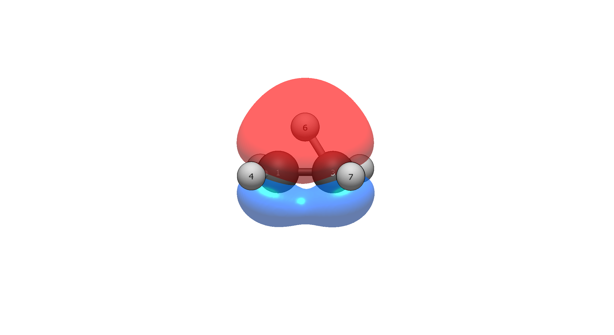

# Carbocations: nonclassical ethylium vs classical tert-butyl

The nonclassical-vs-classical carbocation debate is one of the most famous
controversies in organic chemistry. These two molecules resolve it visually
and quantitatively in a single comparison. Both run at wB97X-D/def2-TZVP;
reproduce with the commands shown.

## Ethylium, C₂H₅⁺ — bridged and nonclassical

```
Input: ethylium.xyz  (H6 bridges the C–C axis; charge +1)
Run:   pixi run python -m avogadro_ibo examples/ethylium.xyz --method wB97X-D --basis def2-TZVP --charge 1 --spin 1
```

Orbital 4 is the whole story:

```
    4    2.000   -0.890787        C-C-H 2e3c  H6(38.5%) + C3(30.7%) + C1(30.7%)    C: 5% 2s + 95% 2px       11.2     <- HOMO
```

The classifier labels it `C-C-H 2e3c` with no special casing — a
three-centre two-electron bond, perfectly symmetric between the carbons,
with hydrogen carrying the largest single share. In `ibo.molden` it
renders as a dome spanning both carbons with H6 symmetric above the axis:
a protonated double bond.

The Wiberg orders confirm the bridge quantitatively:

```
  C1-C3         1.414   1.414   0.000  (+0.011: σ+0.011, π+0.000)
  C3-H6         0.473   0.473   0.000
  C1-H6         0.473   0.473   0.000
```

H6 is half-bonded to each carbon simultaneously (0.473 + 0.473), and the
C–C bond (1.414) is stronger than a single bond because the bridge
reinforces it. Charges: C1/C3 +0.078 each (identical — symmetry intact),
H6 +0.224, carrying the bulk of the positive charge despite being the
bridge atom. The near-zero LUMOs (−0.064 Ha) flag genuine instability:
the ion is barely holding together.



## Tert-butyl, C₄H₉⁺ — textbook classical

```
Input: tbutyl.xyz  (charge +1)
Run:   pixi run python -m avogadro_ibo examples/tbutyl.xyz --method wB97X-D --basis def2-TZVP --charge 1 --spin 1
```

Everything ethylium wasn't. The LUMO is the classic empty p orbital —
86.3% on C1, pure 2p — with tiny 2.9% tails on each methyl carbon. The
charge sits exposed: C1 +0.400, no bridging, C–C orders of only 1.121
against ethylium's 1.414. The LUMO at −0.169 Ha is *more* negative than
ethylium's −0.064: t-butyl is the more electron-deficient ion, because
bridging stabilises ethylium by filling the empty orbital with a 3c–2e
bond that t-butyl cannot form.

Hyperconjugation, quantified. Two distinct C–H families emerge:

- Orbitals 8–10: `C(52.8%) + H(42.3%) + C1(4.6%)` — axial C–H bonds
  aligned to donate into the empty p; through-bond C1–H Wiberg **0.059**.
- Orbitals 11–16: `C(54.6%) + H(44.0%) + C1(1.1%)` — equatorial C–H
  bonds near-perpendicular to the empty p; C1–H Wiberg **0.012**.

The 5:1 ratio (0.059 vs 0.012) is the dihedral-angle (cos²φ) dependence
of hyperconjugation made quantitative — axial donors beat equatorial
ones fivefold, exactly as textbook orbital overlap predicts. The C–C
1.121 orders carry the same signature: slight π character from methyl
donation, far below true bridging.

## The comparison

| Property | Ethylium (bridged) | tert-Butyl (classical) |
|----------|--------------------|------------------------|
| Charge on C⁺ | +0.078 (×2) | +0.400 |
| Bonding orbital | `C-C-H 2e3c` | empty p (LUMO) |
| C–C bond order | 1.414 | 1.121 |
| LUMO energy | −0.064 Ha | −0.169 Ha |
