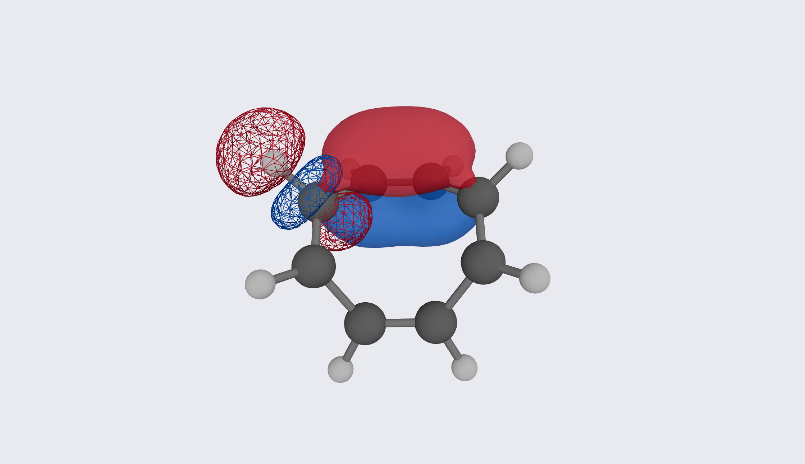
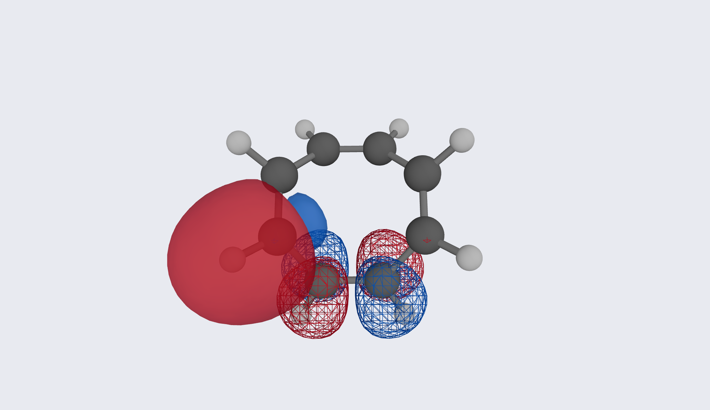

# COT — hyperconjugation with a dihedral knob

```
Input: cyclooctatetraene.xyz  (D2d tub)
Run:   pixi run python -m avogadro_ibo examples/cyclooctatetraene.xyz --method wB97X-D --basis def2-TZVP
```

Cyclooctatetraene's tub conformation makes it a laboratory for
geometry-dependent hyperconjugation. In a planar ring every C–H
would see the same π*; the tub gives each C–H a different dihedral
to each π*, and the Wiberg orders resolve the differences. Double
bonds read 1.886 (σ 1.008 + π 0.878), singles 1.054, cross-ring
contacts 0.053 — not benzene's 1.444, because the tub is not
aromatic. The detail section fires exclusively on π×π pairs
(`C7-C8: orb27(C-C π) × orb28(C-C π): -0.0263`): neighbouring π
bonds eroding each other on the shared double bond. That sign is
conjugation, the same compete/cooperate reading as diborane, now
on a π framework.

The through-space C–H couplings come in two flavours: 0.014 across
one bond vs 0.011 across two (rows `C3-H15`, `C7-H14` vs their 1,4
counterparts). Each has a live parenthetical splitting σ and π
parts. That 0.014/0.011 difference is small but real — not PM
noise. It tracks the dihedral angle between each C–H σ and the
adjacent π system roughly as cos²φ. NMR's Karplus curve is the
same geometry dependence for *J*; here it is hyperconjugation as a
bond order. In a hypothetical planar COT every C–H would be
symmetry-equivalent and this structure would vanish. The tub
breaks the symmetry, and the table reports the consequences bond
by bond.

The images show both donation directions at once: C–H σ → C–C π* and
C–C π → C–H σ*. That is the same overlap integral, donor and acceptor
swapped. Both are visible only because the tub angles the two
manifolds into each other the way flat rings cannot.



