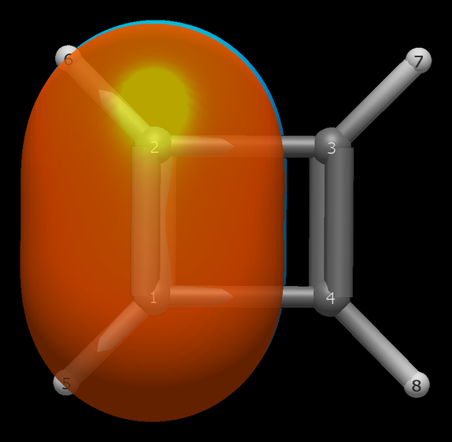

# Cyclobutadiene — antiaromaticity escaping through distortion

The square D4h cyclobutadiene is a transition state, not a ground state minimum:
Jahn–Teller distortion drops it to a rectangular D2h minimum with
alternating bond lengths (1.326 / 1.566 Å at wB97X-D/def2-TZVP). The
IBO table shows what that escape costs and buys — delocalization
surrendered for two isolated double bonds.

```
Input: cyclobutadiene.xyz  (D2h minimum; ORCA 6.1.1 wB97X-D3/def2-TZVP opt + freq, no imaginary modes)
Run:   pixi run python -m avogadro_ibo examples/cyclobutadiene.xyz --method wB97X-D --basis def2-TZVP
```

```
  Bond         Total       σ       π              (interference)
  C1-C2         2.010   1.010   1.000  (+0.008: σ+0.008, π+0.000)
  C3-C4         2.010   1.010   1.000  (+0.008: σ+0.008, π+0.000)
  C1-C4         0.972   0.972   0.000  (-0.003: σ-0.003, π+0.000)
  C2-C3         0.972   0.972   0.000  (-0.003: σ-0.003, π+0.000)
```

No compromise values anywhere: the π column reads 1.000, 1.000, 0.000,
0.000 — two full double bonds and two pure singles, where benzene
reads 1.444 six times over. The classifier agrees, labelling orbs
13–14 `C-C π` at exactly 50/50 and parking the HOMO (−0.359 Ha) on
them:


*Orbitals 13–14 (HOMO): the two localized C–C π bonds on the short
(1.326 Å) edges — the D2h rectangle rendered, delocalization
visibly absent.*

Antiaromaticity doesn't smear here; it sorts. The diagonal
C···C contacts (0.012) confirm nothing leaks across the ring.

The one subtlety is in the C–H bonds: each carries a −0.023
parenthetical with a −0.0114 detail line (`C-H σ × C-C σ`), the σ
framework absorbing the strain of the 90° corners — the same
bent-bond early warning the nonplanar cyclopropenyl anion tripped.
And the near-miss footnote fires (4 terms, largest −0.0055), so the
sub-threshold ledger stays complete.

Set against the cyclopropenyl anion's refusal to delocalize
([aromaticity-cyclopropenyl.md](aromaticity-cyclopropenyl.md)),
cyclobutadiene is the other answer to the same 4n problem: localize
by geometry instead. Both molecules agree on the verdict — no
delocalized 4n π system survives contact with a real minimum.

---
*Geometry optimized in ORCA 6.1.1 (wB97X-D3/def2-TZVP), confirmed
minimum by frequency calculation (no imaginary modes): C–C 1.326 /
1.566 Å alternating (D2h). IBO analysis with Psi4 1.11
(wB97X-D/def2-TZVP, RHF), avo_ibo 0.4.0; Pipek–Mezey localization
(p = 2 → 4) per Knizia 2013.*
