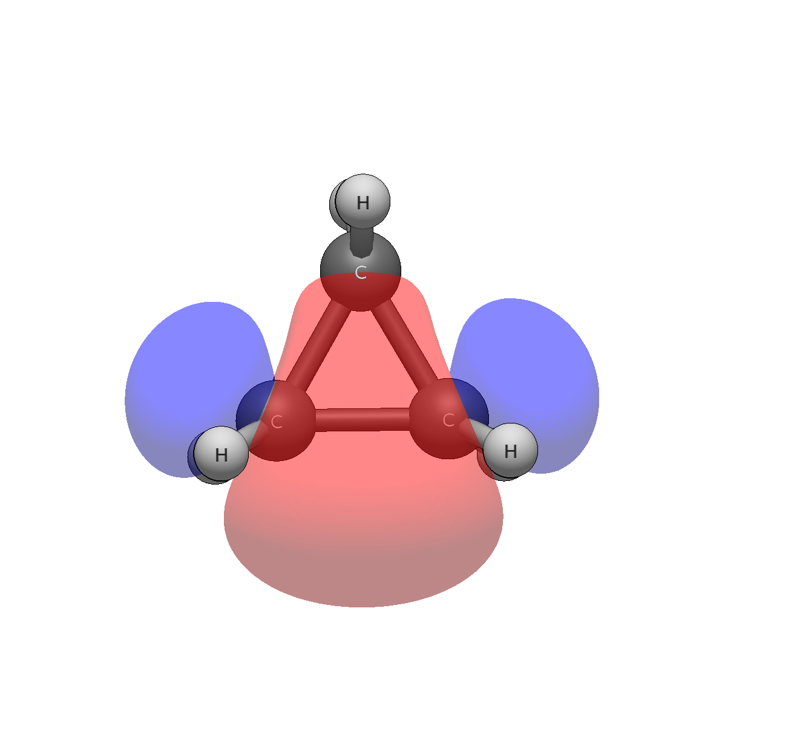

# Cyclopropane — bent bonds and p-rich strain

```
Input: cyclopropane.xyz  (D3h)
Run:   pixi run python -m avogadro_ibo examples/cyclopropane.xyz --method wB97X-D --basis def2-TZVP
```

The C–C bonds refuse to point along the internuclear axes — a 60° ring
cannot accommodate tetrahedral orbitals, so the bonds bend outward:

```
   10    2.000   -0.564558           C-C σ †  C2(49.6%) + C1(49.6%) + C3(0.6%)    18% 2s + 82% 2py          0.0           
   11    2.000   -0.564533           C-C σ †  C1(49.6%) + C3(49.6%) + C2(0.6%)    18% 2s + 82% 2px          0.0           
   12    2.000   -0.564521           C-C σ †  C3(49.6%) + C2(49.6%) + C1(0.6%)    18% 2s + 82% 2px          0.0    <- HOMO
```

Three things to read here, in the order the columns teach them.
First, the hybrid: 18% s + 82% p ≈ sp4.6 — far beyond sp³ (25% s).
Ring strain forces the bonding orbitals into almost pure p
character. That p-rich density bulging outside the ring is
nucleophilic, which is why cyclopropane undergoes homoconjugation
with adjacent π systems and reacts at the ring face with
electrophiles. The hybrid column is the strain. Second, the 0.6%
third-carbon tail on each bond: tiny through-ring coupling, resolved
quantitatively — not a 2e3c (the third atom misses 10%), but not
zero either. Third, the HOMO (orb 12) is a bent C–C σ bond, not a
π bond. Unusual, and the reason for cyclopropane's electrophilic
reactivity at the ring: the highest occupied orbital *is* the bent
bond.

The C–C Wiberg order is 0.998 with a live interference parenthetical.
The detail section fires (`C2-C3: orb11(C-C σ) × orb12(C-C σ):
-0.0171`): neighbouring bent bonds erode each other slightly through
orthogonalization on the shared carbon. The cyclopropenyl cation
shows the same curved-outside-the-ring σ topology, tighter and more
directional there — sp² carbons leave less s character for the σ
framework than sp³ carbons do.


