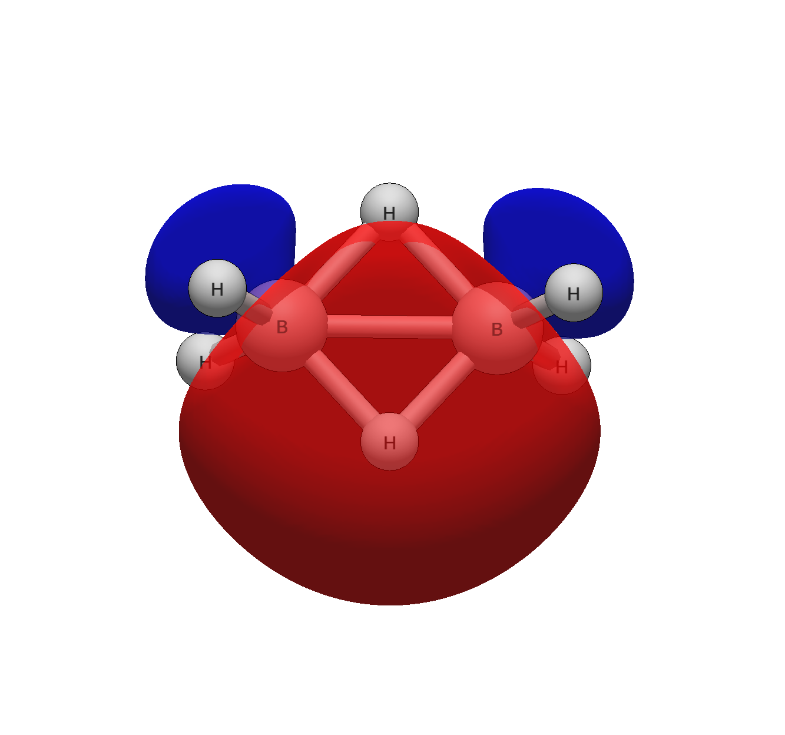

# Diborane — three-centre two-electron bridges

```
Input: diborane.xyz  (wB97X-D/6-31G(d,p) geometry)
Run:   pixi run python -m avogadro_ibo examples/diborane.xyz --method wB97X-D --basis def2-TZVP
```

The two bridging hydrogens refuse the two-centre picture. Orbitals 3
and 4 are labelled `B-B-H 2e3c` with no special casing — H(45.1%) +
B(27.3%) + B(27.3%), nearly degenerate (−0.6103/−0.6103 Ha), against
four ordinary terminal B–H σ bonds (0.984 each):

```
    3    2.000   -0.610304      B-B-H 2e3c †  H5(45.1%) + B1(27.3%) + B6(27.3%)               B: 22% 2s + 78% 2pz      24.6           
    4    2.000   -0.610275      B-B-H 2e3c †  H3(45.1%) + B1(27.3%) + B6(27.3%)               B: 22% 2s + 78% 2pz      24.7           
```

The Wiberg table then shows what "three-centre" costs in pair terms:
each bridge leg reads 0.482, the B–B contact 0.634 — and the detail
section attributes the interference to a single pair, both directions:

```
  B1-B6: orb3(B-B-H 2e3c) × orb4(B-B-H 2e3c): +0.0134
  B1-H5: orb3(B-B-H 2e3c) × orb4(B-B-H 2e3c): -0.0134
  ...
  H3-H5: orb3(B-B-H 2e3c) × orb4(B-B-H 2e3c): +0.0134
```

The two bridge bonds compete on every shared leg (−0.0134: orthogonalization
against each other) while cooperating across the B–B contact (+0.0134) —
and even across the H···H contact between the bridges (+0.0134 on H3–H5).
One orbital pair, three signs, each chemically legible. This is the
pair-interference detail section at its best: the aggregate column only
says "−0.015 here, +0.016 there"; the detail says why.


