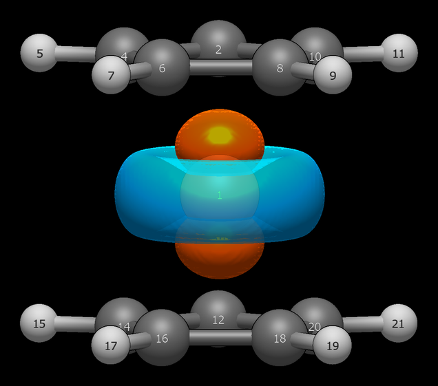

# Ferrocene — ten equivalent bonds, and where the partition stops

Ferrocene is the gallery's transition-metal exam: ten Fe–C contacts
related by D5h symmetry, d-electron donation both ways, and a
localization functional with no knowledge of point groups. It passes —
with one honest failure that extends the tool's known limitation into
new territory.

```
Input: ferrocene.xyz  (ORCA 6.1.1 wB97X-D3/def2-TZVP opt + freq from exact D5h, no imaginary modes)
Run:   pixi run python -m avogadro_ibo examples/ferrocene.xyz --method wB97X-D --basis def2-TZVP
```

Two legs, following Knizia 2013 Appendix E. The unoptimized
construction from experimental distances is disclosed, not hidden.
Leg 1 is exact D5h from Fe–C 2.064 / C–C 1.440 / C–H 1.08 Å.
Leg 2 is ORCA-relaxed from that start (Fe–C 2.050, C–C 1.4196).
D5h stays intact to 1e-4 with no symmetry constraints — the
functional respects the group unassisted, so no constrained rerun
was needed.

**The density totals respect D5h perfectly, in both legs:**

```
  Bond         Total       σ       π       δ              (interference)
  Fe1-C18        0.534   0.442   0.001   0.091  (-0.012: σ-0.015, π-0.004, δ+0.007)
  Fe1-C6         0.534   0.129   0.295   0.110  (-0.041: σ-0.020, π-0.018, δ-0.003)
  Fe1-C20        0.534   0.338   0.075   0.121  (-0.047: σ-0.057, π+0.022, δ-0.011)
  Fe1-C2         0.534   0.442   0.001   0.091  (-0.012: σ-0.015, π-0.004, δ+0.007)
```

Ten contacts, identical to three decimals — half-bonds. When every
symmetry-equivalent total matches, the density is telling you the
metal–ring donation is even. The charges match that picture: Fe
−0.238, every carbon −0.055, every hydrogen +0.080. Six "Deloc"
orbitals at ~22% Fe are the ring-π / metal-d bridges. The
nonbonding dz² (orb 46, 98.6%) sits apart exactly where ligand-field
theory puts it — a check that localization did not scramble a
textbook orbital. And the e₂′ δ set prints as δ, not σ:

```
    #      Occ      Energy              Type  Composition              Hybrid                   Ion%        H/L
   47    2.000   -0.292187            Fe-C δ  Fe1(84.2%) + C10(3.9%) + C20(3.9%) + C18(1.8%)      100% 3dx2y2              91.2           
   48    2.000   -0.291770            Fe-C δ  Fe1(84.3%) + C14(3.1%) + C4(3.1%) + C6(3.0%)        100% 3dx2y2              92.8    <- HOMO
   49    0.000    0.162575         Fe-C π* †  Fe1(73.8%) + C18(5.4%) + C8(4.9%) + C4(4.5%)        100% 3dxz                 ---    <- LUMO
```

The classifier keys δ off the dominant spherical d on a 3d metal
(dxy/dx2y2 → δ; dxz/dyz → π; dz2 → σ), so the HOMO/LUMO is an Fe–C
δ/π* pair (−0.292/+0.163 Ha) — the correct ligand-field reading,
where the old table said σ/σ*.


*Orbital 46: the nonbonding dz², 98.6% Fe — the a1g orbital
ligand-field theory predicts, untouched by either ring.*

**But the σ/π partition does not respect D5h — and that is the
finding.** Same-total bonds decompose incompatibly: the table's first
row is almost pure σ, the second is mixed. That is not a chemical
difference between those two Fe–C contacts; it is the localizer
picking an arbitrary plane in a degenerate subspace. Worse, the
assignment *permutes between legs*. Leg 1 puts the π-heavy character
on Fe1–C20; Leg 2 moves it to Fe1–C6. Totals are density-protected
and reproducible. The partition is not: Pipek–Mezey only sees atomic
populations, so it cannot choose among rotations that keep every
atom's population the same. Wherever symmetry-equivalent bonds share
overlapping Fe-d/C-p subspaces, the σ/π split is
localization-trajectory-dependent. This is the gallery's standing PM
caveat (benzene C–H split, SO₃ d-asymmetry) in a new place: not
energies or coefficients, but the decomposition itself.

The ten contacts even fall into a telling pattern. Grouped by
decomposition fingerprint — σ-heavy (C2/C8/C12/C18), π-heavy
(C4/C6/C14/C16), mixed (C10/C20) — and mapped onto ring angles,
every group closes under reflection through the 108°/288° plane
(0+216 = 72+144 = 288+288 = 216°), with top/bottom pairs identical
throughout. The landslide stopped at a subgroup: σh exactly
preserved, C5 broken to one approximate vertical mirror (partners
differ at the third decimal), D5h → ~Cs. PM does not scramble
symmetry randomly; it keeps what the density enforces and spends
the rest on trajectory luck.

The reading rule that follows: quote totals and compositions for
ferrocene, never per-bond σ/π splits. Switching functionals would
not help. Boys localization cannot separate σ from π by construction
— it returns banana bonds for multiples — so it would abolish the
distinction rather than symmetrize it. A documented limitation with
a characterized failure mode beats a hidden one. Use the tool where
it is exact; do not ask the σ/π columns for a symmetry they cannot
give.

---
*Leg-1 geometry: exact D5h from experimental parameters (Fe–C 2.064,
C–C 1.440, C–H 1.08 Å), unoptimized per Knizia 2013 Appendix E.
Leg-2 geometry optimized in ORCA 6.1.1 (wB97X-D3/def2-TZVP),
confirmed minimum by frequency calculation (no imaginary modes).
IBO analysis with Psi4 1.11 (wB97X-D/def2-TZVP, RHF), avo_ibo 0.4.0;
Pipek–Mezey localization (p = 2 → 4) per Knizia 2013.*
