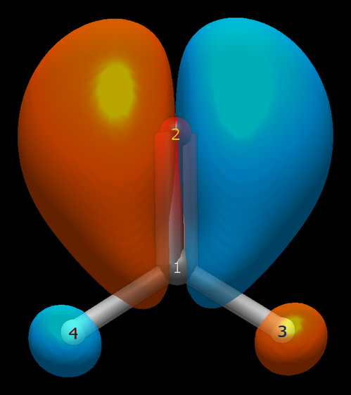

# Formaldehyde — the lone pair that reaches into the C–H bonds

Formaldehyde's HOMO is drawn in every textbook as an oxygen in-plane
lone pair. The IBO table agrees — and then quantifies the fine print
the textbooks omit: that lone pair leaks onto both C–H bonds, at
−0.0625 a pair the largest hyperconjugative fingerprint in this
gallery.

```
Input: formaldehyde.xyz  (ORCA 6.1.1 wB97X-D3/def2-TZVP opt + freq, no imaginary modes)
Run:   pixi run python -m avogadro_ibo examples/formaldehyde.xyz --method wB97X-D --basis def2-TZVP
```

```
    #      Occ      Energy              Type  Composition              Hybrid                   Ion%        H/L
    8    2.000   -0.411669             O(LP)  O2(93.5%) + C1(3.1%) + H3(1.7%) + H4(1.7%)    100% 2py                 93.6    <- HOMO
```

93.5% oxygen, pure 2py — unmistakably the in-plane LP — with 3.1% on
carbon and 1.7% on each hydrogen. The C–H bonds pay for the visit:

```
  Bond         Total       σ       π              (interference)
  C1-H3         0.925   0.955  -0.030  (-0.072: σ-0.040, π-0.033)
  C1-H4         0.925   0.955  -0.030  (-0.072: σ-0.040, π-0.033)
  O2-H3         0.062   0.000   0.062  (-0.004: σ-0.002, π-0.002)
  O2-H4         0.062   0.000   0.062  (-0.004: σ-0.002, π-0.002)
```

Depleted to 0.925 with −0.030 of π character — σ/π mixing in a bond
with no π business — and a −0.072 parenthetical, the largest in the
gallery, decomposing in the detail section as `C-H σ × O(LP):
−0.0625` on each leg, all subtractive. The through-space O···H
contacts (0.062, pure π) are the same donation read from the other
end. Donation reads as depletion, once more: the donors give, the
donors weaken.

Meanwhile the C=O bond itself over-delivers: 2.038 total with π at
1.063 — more than a full π bond, fed by the same oxygen that donates
sideways. And the charges understate the textbook picture: C +0.207,
O −0.280, a modest polarization for the canonical polar double bond —
the density stays shared even as the orbitals tell a donor story.


*Orbital 8 (HOMO): the oxygen in-plane lone pair, 93.5% O with 3.1%
on C and 1.7% on each H — the C–H tails rendered.*

---
*Geometry optimized in ORCA 6.1.1 (wB97X-D3/def2-TZVP), confirmed
minimum by frequency calculation (no imaginary modes). IBO analysis
with Psi4 1.11 (wB97X-D/def2-TZVP, RHF), avo_ibo 0.4.0; Pipek–Mezey
localization (p = 2 → 4) per Knizia 2013.*
