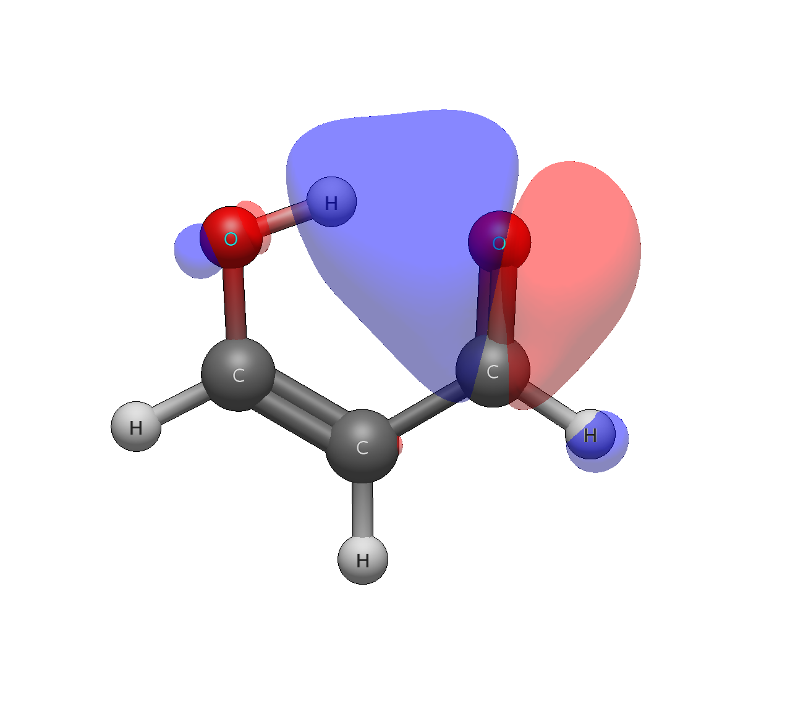

# Malonaldehyde enol — hydrogen bond and conjugation, quantified

```
Input: malonaldehyde_enol.xyz  ((Z)-3-hydroxyprop-2-enal)
Run:   pixi run python -m avogadro_ibo examples/malonaldehyde_enol.xyz --method wB97X-D --basis def2-TZVP
```

The intramolecular O···H–O bridge is written all over the data, in both
donation directions. The O–H σ* (orb 22: H7 63.4% + O5 29.8%) carries a
**6.5% O3 tail** — the acceptor oxygen's lone pair leaking into the
antibond across the ring — and the O3–H7 Wiberg order is **0.159**, a
real quantifiable interaction rather than a geometric coincidence. The
donor side shows it too: orb 18 on O3 reaches 5.1% onto H7.

The conjugated backbone reads as a resonance series in the Wiberg
column: C–O 1.733 (aldehyde C=O), C–C 1.587 (enol partial double), C–O
1.273 (enol C–O), C–C 1.179 — with the π components (0.680 / 0.587 /
0.299 / 0.221) tracking the same gradient. The two carbonyl-like π
bonds differ sharply in ionicity (79.4% vs 44.2%): one is a true
carbonyl, the other belongs to the conjugated enol system. And the
detail section is the richest in the whole set — `C1-C2: orb16(C-O π)
× orb19(C-C π): -0.1616` against `orb17 × orb19: +0.0334` on the same
bond: competing π channels eroding and reinforcing the same C–C link,
conjugation rendered as rival orbital interactions rather than a
single delocalised smear. LUMO (C–C π*) already carries 12.6% oxygen
character — the π* is not purely carbon–carbon.

Lone pairs, π ionicity gradients, hydrogen bonding, conjugation, and
virtual-orbital character in one nine-atom molecule: the strongest
single demonstration of what the table reads out.


