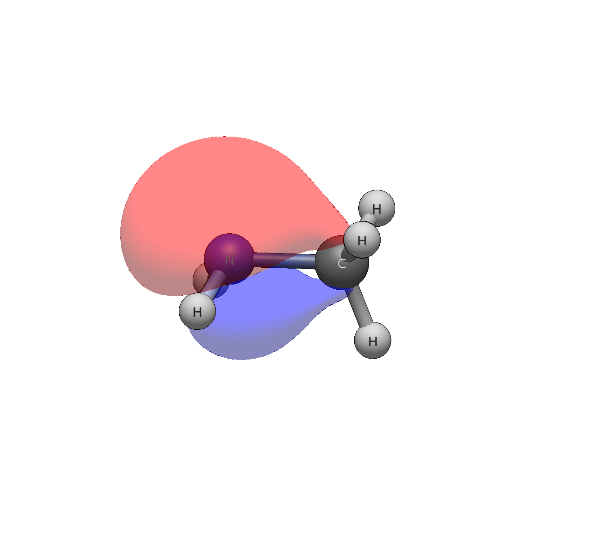
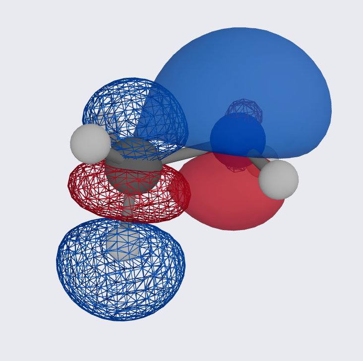

# Methylamine — amine lone pair and C–N bonding

```
Input: methylamine.xyz
Run:   pixi run python -m avogadro_ibo examples/methylamine.xyz --method wB97X-D --basis def2-TZVP
```

The amine lone pair (orb 9, HOMO) is 98.7% on nitrogen, 24% 2s + 76%
2p — predominantly p-type, as expected for a pyramidal amine — with
small tails onto carbon (0.6%) and one hydrogen (0.5%) that betray its
delocalisation into the methyl framework. Compare ammonia's LP (18% s)
in the first-look set: methylation pushes slightly more s character
into the lone pair. Charges: N −0.424, C −0.046, amine H's positive —
the C–N bond (Wiberg 1.026, essentially single) is polarised toward
nitrogen without drama.

The three C–H bonds split into a degenerate pair (orbs 6–7, −0.5703 Ha)
plus a single orb 8 (−0.5689 Ha) distinguished by its 2py composition —
the C–H bond antiperiplanar to the lone pair feels a different
electrostatic environment than the other two. Small, but resolved.



