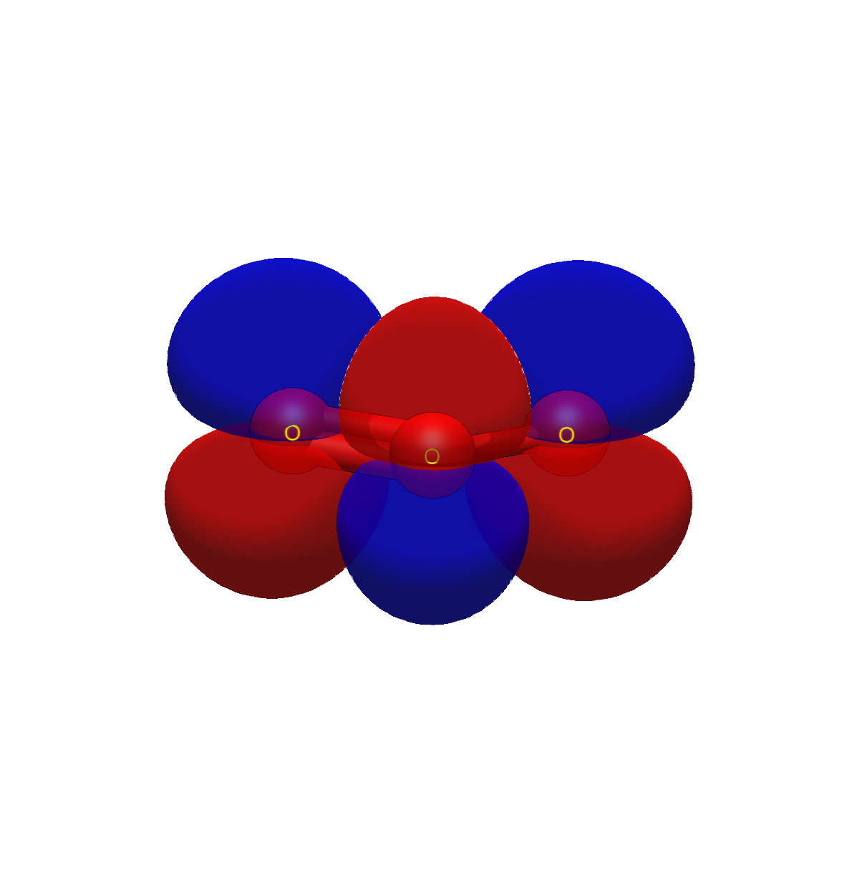

# Ozone — charge separation and through-bond coupling

```
Input: ozone.xyz
Run:   pixi run python -m avogadro_ibo examples/ozone.xyz --method wB97X-D --basis def2-TZVP
```

> **Provenance caution.** This geometry was recovered from a prior
> calculation and its O–O distance (1.11 Å) is short of the
> experimental 1.27 Å; ozone's multireference character makes it
> sensitive to geometry. The charge and coupling pattern below
> reproduces across levels, but re-optimize (ORCA, wB97X-D3/def2-TZVP
> or better) before quoting these numbers in production.

With that said, the table tells ozone's whole reactivity story at a
glance. Charges: central O +0.472, terminals −0.236 each — the famous
charge separation behind its electrophilicity, straight out of the
resonance structures but now as numbers. The O–O bonds read 1.443 (σ
0.985 + π 0.458), and the terminal O···O contact — two atoms not bonded
in any Lewis structure — carries **0.511**, nearly half a bond: σ 0.096
+ π 0.415, with the detail section showing `orb9 × orb10: +0.2075`,
the 3-centre π bond leaking across the terminal pair. For scale:
benzene's meta C–C is 0.115, SO₃'s O–O 0.241 — ozone's direct bent
π pathway roughly doubles SO₃'s threefold-symmetric one.

The frontier picture completes it: LUMO is the symmetric O π* at
+0.007 Ha — accessible at room temperature, hence the extraordinary
reactivity — while the terminal-oxygen lone pairs (−0.487 Ha, 98% 2p)
are the nucleophilic sites for 1,3-dipolar cycloaddition. Electrophile
and nucleophile, HOMO and LUMO, in one table.


